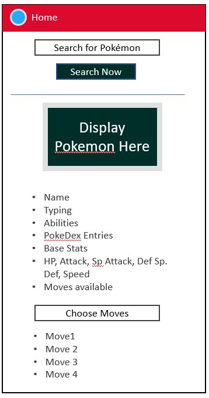
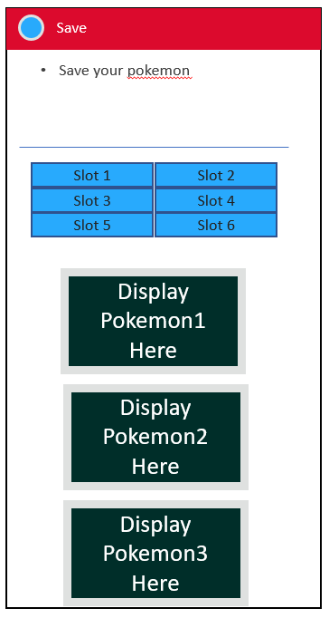
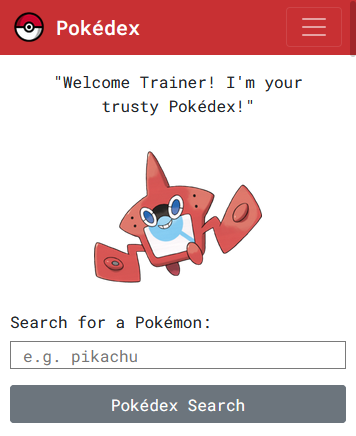
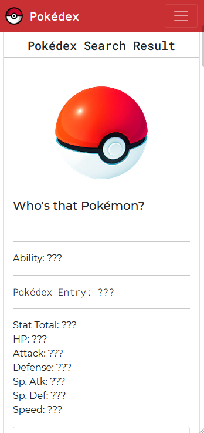
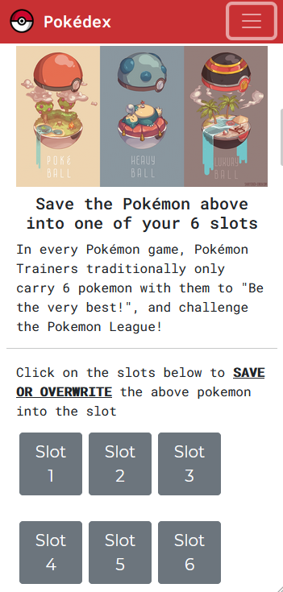
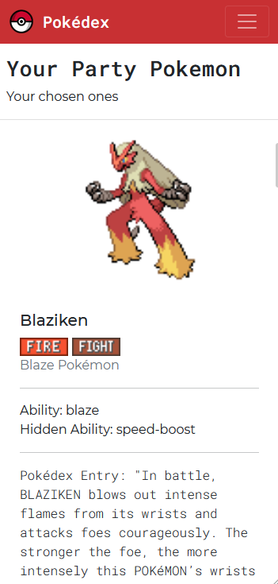
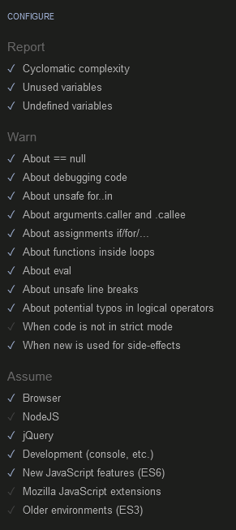

#  Pokédex

# 1. Background & Objective
## Background / Problem Statement
Usually when playing pokemon games, the player is bombarded with many options, and they might not know which pokemon are good options for them to choose for their party of 6 for battling the games' final bosses.

Furthermore, due to the many versions, no one pokedex has been able to display all the 800+ pokemon in one single endpoint.

## Objective
Design a simple pokedex. When users fill in the form and ask the pokedex to "search", display the following details

1. Pokemon Name
2. Picture of pokemon
3. Stats of the pokemon, like height, weight, size
4. Type of the pokemon
5. Abilities and description of the abilities
6. Base Stats of the pokemon - HP, Attack, Special Attack, Defense, Special Defense, Speed
7. Save up to 6 pokemon so you can refer to them again

## Purpose and Value to users

1. One stop to see all pokemon in one place
2. Immediate display of sprites and pokedex entries tell a story of all pokemon, even those that the use may not know
3. Typing and movesets allow the user to put together a party of 6
4. User can come back even after leaving the website, to view the pokemon that they have selected, and even the moves that they have already selected.

# 2. Demo (Github Pages)
Site is published via github pages and can be viewed [here](https://malrhis.github.io/Project-2-codeinstitute/)

# 3. Technologies Used
- HTML
- CSS
- Bootstrap 4
- Javascript
- Jquery
- Jquesry UI

# 4. The Goals: User Stories or (JTBD) Jobs-to-be-Done

For the players of pokemon games, or fans who want to be able to search for the full breadth of the pokemon franchise:

```
1. I want to be able to search for a pokemon by name, instead of going through the clunky gameboy/switch keypad
2. I want to be able to view all pokemon across all the game versions.
3. The pokedex in the pokemon games does not give you enough information about the pokemon in a single screen. For instance, it does not tell you the stats of the pokemon:
    - I want to be able to see a sprite of the pokemon
    - I want to be able to see the type/types of the pokemon
    - I want to be able to see the ability that the pokemon has, and if the pokemon has a hidden ability, I want that to be displayed
    - I want to be able to read about the pokemon's genus and pokedex entry
    - I want to know what moves does the pokemon have
4. I want to be able to save my pokemon so that I can refer to them later
5. I want to be able to build a mock-up team
```

# 5. Key Features
- Pokemon API retrieval via [PokeAPI](https://pokeapi.co/)
- Local storage using javascript to remember previous pokemon choices and store them in 6 slots
- Auto-complete dropdown to help with users who might not know how to spell the full pokemon name in the search bar
- Form submit, information display and information storage in Local Storage
- Display of pokemon details via HTML and CSS manipulation and DOM traversal

## 5.1 Feature List
|# | Name          | Description   |     
| -| ------------- |-------------|
|1 |Pokemon API retrieval|via [PokeAPI](https://pokeapi.co/)| 
|2 |Autocomplete Search Bar for Pokedex| Using https://pokeapi.co/api/v2/pokemon/| 
|3 | Navigation Bar with Anchor links within page |       | 
|4 | Retrieval of Pokemon Genus & Flavour Text | https://pokeapi.co/api/v2/pokemon-species/| 
|5 | Extraction of pokemon moves |via [PokeAPI](https://pokeapi.co/)| 
|6 | Storage of Pokemon into LocalStorage | Inclusive of pokemon stats and moveset|
|7 | Retrieval of stored pokemon | Up to 6 pokemon can be saved|
<br>

# 6. Prototyping
Simple Prototyping was done directly using MS Powerpoint to mock-up the features of the website.

Reference was taken from:
- [The official Pokemon website's pokedex](https://sg.portal-pokemon.com/play/pokedex)
- [Original Pokedex design](https://bulbapedia.bulbagarden.net/wiki/Pok%C3%A9dex)
- [Party Pokemon List of the Pokemon Games](https://bulbapedia.bulbagarden.net/wiki/Party)

## 6.1 Front-End UI Mock-up



Reference was taken from the original design of the very first pokdex art from generation 1 of the pokemon games:


## 6.2 Actual Final Design
The final design aims to provide a solution to all user stories listed in `section 4 The Goals: User Stories or (JTBD) Jobs-to-be-Done` 


```
1. I want to be able to search for a pokemon by name, instead of going through the clunky gameboy/switch keypad
2. I want to be able to view all pokemon across all the game versions.
```



```
2. I want to be able to view all pokemon across all the game versions.
3. The pokedex in the pokemon games does not give you enough information about the pokemon in a single screen. For instance, it does not tell you the stats of the pokemon:
    - I want to be able to see a sprite of the pokemon
    - I want to be able to see the type/types of the pokemon
    - I want to be able to see the ability that the pokemon has, and if the pokemon has a hidden ability, I want that to be displayed
    - I want to be able to read about the pokemon's genus and pokedex entry
    - I want to know what moves does the pokemon have
```



```
4. I want to be able to save my pokemon so that I can refer to them later
```



```
3. The pokedex in the pokemon games does not give you enough information about the pokemon in a single screen. For instance, it does not tell you the stats of the pokemon:
    - I want to be able to see a sprite of the pokemon
    - I want to be able to see the type/types of the pokemon
    - I want to be able to see the ability that the pokemon has, and if the pokemon has a hidden ability, I want that to be displayed
    - I want to be able to read about the pokemon's genus and pokedex entry
    - I want to know what moves does the pokemon have
4. I want to be able to save my pokemon so that I can refer to them later
5. I want to be able to build a mock-up team
```

## 6.3 Colour
Something  closer to  the original pokedex colour palette was chosen to enable familiarity in users
```
For the Red: #c83033
For the Gray: #6c757d
```
# 7. Detailed Features
## 7.1 Search Bar
- Implemented using [Jquery UI Autocomplete Widget](https://jqueryui.com/autocomplete/)
- List of pokemon were generated using https://pokeapi.co/api/v2/pokemon/ 
- Array of pokemon that were returned from the endpoint were handled using the `.map()` method to access the nested `names` of the pokemon ([Link to resource](https://developer.mozilla.org/en-US/docs/Web/JavaScript/Reference/Global_Objects/Array/map))

## 7.1.1 Search Bar Validation
- If a non-existing pokemon name is entered, an alert will appear to the user saying `"Please enter a real pokemon"`
- check was done using `.fail()` to check if `response.status == "404"`

## 7.2 Preview Pokemon
* Return the following from `https://pokeapi.co/api/v2/pokemon/{pokemon name}`
  * Pokemon Sprite
  * Pokemon Name
  * Pokemon Type
  * Pokemon Stats
  * Pokemon Moves
  * Pokemon Abilities

* Return the following from `https://pokeapi.co/api/v2/pokemon-species/{pokemon name}`
  *  Pokemon Genus
  *  Pokemon Flavor Text

* Display all data returned from API using `.htm()` method. 

## 7.2.1 Stats Bar
* Stats are displayed using using [Jquery UI Progressbar widget](https://jqueryui.com/progressbar/)
* As the value of the bar is set at `"100"`, and pokemon stats can go up to `>200`, the stats were scaled back to a base of `100` before using `.progressbar()` to create the progressbar in the pokemon card

## 7.2.2 Array manipulation for Pokemon Moves and flavor text
* Pokemon Moves in the response from `https://pokeapi.co/api/v2/pokemon/{pokemon name}` were nested. `.map()` was used to return an array of move names instead of the original objects

* Pokemon Flavor text was embedded in the `https://pokeapi.co/api/v2/pokemon-species/{pokemon name}` endpoint's response array. 
  * in order to extract only the english pokedex flavor text, the `.find()` method was used ([Link to resource](https://developer.mozilla.org/en-US/docs/Web/JavaScript/Reference/Global_Objects/Array/find))
  ```
   .find(function (x) {
              return x.language.name == "en";
            }
  ```

* Pokemon Flavor Text had odd characters
  ```
  "Spits fire that\nis hot enough to\nmelt boulders.\u000cKnown to cause\nforest fires\nunintentionally."
  ```
  * These had to be removed using the `.replace()` method ([Link to resource](https://developer.mozilla.org/en-US/docs/Web/JavaScript/Reference/Global_Objects/String/replace))
  ```
  .flavor_text.replace(/\r\n|\n|\r|/gm, " ")}"`);
  ```
  * "" character was also found in the response from the API, and had to be removed from the flavor text upon further testing.

## 7.2.3 Pokemon Move selection: double-entry validation 
In the event user selects the same move again from the dropdown of the moves, an alert will appear telling the user that the `"Move has already been selected"` The user will be blocked from adding that move to the movelist of the pokemon

## 7.2.4 Pokemon Abilities
In the event that pokemon have a hidden ability, the `getpokemon()` function used to display pokemon, as well as the handling of the initial API call for `Preview Pokemon` will check if there's a hidden ability
```
if (pokemonPreview.abilities[1]) {
          $(`.pokemon-${x}-ability`).html(
            `Ability: ${pokemonPreview.abilities[0].ability.name} 
          <br> Hidden Ability: ${pokemonPreview.abilities[1].ability.name}`
          );
        } else {
          $(`.pokemon-${x}-ability`).html(
            `Ability 1: ${pokemonPreview.abilities[0].ability.name}`
          );
        }
```


## 7.2.5 Saving Pokemon into party of 6
Once any of the 6 buttons have been clicked to save the pokemon, both the movesets that have been chosen, the pokemon array and the pokemon species array would be saved into localStorage, and immediately displayed using the `getpokemon()` function. 

`LocalStorage.setItem` for saving
```
localStorage.setItem("pokemon1", JSON.stringify(pokemonPreview));
localStorage.setItem("pokemon1Species",JSON.stringify(pokemonPreviewSpecies)
localStorage.setItem("1ChosenMoveList", JSON.stringify(saveMovelist));
```

`getPokemon()`function
Takes in an argument of any of the 6 pokemon `value: 1 to 6`, and display all of the details stored in localStorage. 


# 8. Bootstrap 4 and Jquery Implementation
- Bootstrap 4 was used for re-building the website in a responsive, mobile-first manner. You can access Boostrap 4 resouces [here](https://getbootstrap.com/docs/4.5/getting-started/introduction/)

- Jquery library was used to simplify HTML DOM traversal and manipulation, event handling and calling of PokeAPI
Jquery can be accessed at this [link](https://jquery.com/download/)

- Jquery UI was further used to enable the searchbar to have auto-complete features and to implement component like progressbar. Jqery UI library can be accessed at this [link](https://jqueryui.com/download/)

The below `code snippets` were added to HTML `<head>`

- For CSS
```
- <link rel="stylesheet" href="https://cdn.jsdelivr.net/npm/bootstrap@4.5.3/dist/css/bootstrap.min.css" integrity="sha384-TX8t27EcRE3e/ihU7zmQxVncDAy5uIKz4rEkgIXeMed4M0jlfIDPvg6uqKI2xXr2" crossorigin="anonymous">

- <script src="https://cdn.jsdelivr.net/npm/bootstrap@4.5.3/dist/js/bootstrap.bundle.min.js" integrity="sha384-ho+j7jyWK8fNQe+A12Hb8AhRq26LrZ/JpcUGGOn+Y7RsweNrtN/tE3MoK7ZeZDyx" crossorigin="anonymous"></script>
```
- For JQuery and Jquery UI
```
- <script src="https://code.jquery.com/jquery-3.5.1.min.js" integrity="sha256-9/aliU8dGd2tb6OSsuzixeV4y/faTqgFtohetphbbj0=" crossorigin="anonymous"></script>

- <script src="js/jquery-ui.min.js" crossorigin="anonymous"></script>
```
# 10. Content Credits
## Images of pokemon
- Rotom Pokedex picture - https://www.serebii.net/
- Pokemon Sprites - https://pokeapi.co/
- Pokeball Interior Banner - https://www.deviantart.com/shattered-earth/art/Pokeball-Interiors-571971799

## Pokemon Stats, Names, Flavor Text
- https://pokeapi.co/

## Pokemon Type Icons
- https://www.serebii.net/

## 11. Font
Font was implemented using google fonts. In order to mimic the robotic nature of the pokedex, all text related to the pokedex "speaking" was using `Roboto Mono`. Other text is rendered using `Monserrat`

```
<link
      href="https://fonts.googleapis.com/css2?family=Montserrat:ital,wght@0,100;0,200;0,300;0,400;0,500;1,100;1,200;1,300;1,400;1,500&family=Roboto+Mono:ital,wght@0,100;0,200;0,300;0,400;0,500;1,100;1,200;1,300;1,400;1,500&display=swap"
      rel="stylesheet"
    />
```

# 12. Testing
## 12.1 Code Validation using Code Validators
- `style.css` was validated using the W3C Jigsaw validator ([Link](https://jigsaw.w3.org/css-validator/validator))
  - No issues were found with `style.css`
- `script.js` was validated using JShint ([Link](https://jshint.com/))
  -  The following configurations were included in JShint:
  - 
  - No issues were found with `New Javascript features (ES6)` and `jQuery` checked in the configuration list
  
- `index.html` was validated using the W3 Nu HTML Validator ([Link](https://validator.w3.org/nu/#file))
  - It was found that `<section>` tags and `label`/`placeholder` attributes were wrongly used.
  - Code was changed to remove erroneous tags and attributes. Replaced these tags with `<div>` and `<p>` to render content instead.
  - Post code fix Response from Nu Html Checker: `"Document checking completed. No errors or warnings to show."`

## 12.2 Testing and Bug Fixes

| # | Test       | Result           | Fix/Expected Result  |
|-- | ------------- |:-------------:| -----:|
|1  | Pokedex search is supposed to autocomplete all pokemon | Display entire list of pokemon from pokeAPI | NA |
|2  | Enter unlisted pokemon name into pokedex search | No response | Added validation to alert user if they enter a non-existing pokemon name |
|3  | Display of Name | Pokemon names were uncapitalised|Added code handling to ensure that first letter of pokemon name is capitalised |
|4  | Display of pokemon type | If pokemon has 2 types, only one was showing. Expected result is to show both when both are available | Added handling. If pokemon has a 2nd type, display 2nd type. if not then only show one type (if pokemon is a pure typing)
|5  | Display of pokemon stats | Pokemon Stats should scale according to the progressbar widget, but all values of pokemon stats above value 100 resulted in all bars being full for some pokemon. The difference between the 6 stats was lost | Added scaling. pokemon stats were divided by 20 and then multiplied by 100 again. Progress bars now only max out at 200 and above
|6  | Moveset display | Can choose and display as many moves from autocomplete movebar | All Ok
|7  | Moveset duplicate | Found that same move can be selected. Should not be the case as pokemon cannot have duplicated moves | Should only show one move once in the selected displayed move. Added alert to handle if the same move is selected
|8  | Adding of proview pokemon in to 6 slots | Pokemon were able to be successfull stored in local storage. local storage items were found to exist, and retrieval of pokemon Name had no problems
|9  | Overwriting pokemon in slot | If pokemon has already be saved in slot X, attempt to override the pokemon in slot X with another pokemon | All Ok|
|10 | Refresh page to check if pokemon saved stay in slot | Pokemon stayed in page because of getpokemon function at beginning of script.js | All Ok|
|11 | Pokemon move permanence and transfer | Selected moves from preview pokemon were to be stored and transferred to the save slots | All Ok |
|12 | Clear Move button | The clear move button cleared the moves for the specific pokemon and removed the element from the html DOM| All OK|
|13 | Test screen size | Tested using Firefox to mock iPhone X, Samsung S9| Save slot buttons were not sizing properly. Edited code to allow bootstrap 4 grid system to apply without buttons overflowing to the next row|
|14 | Test navbar toggle responsiveness | Navbar toggle disappears when changing to Samsung S9 and iphone instead of `responsive`| It was found that the pokeball images used as placeholders were exceeding the viewport size and pushing the navbar toggle off the viewport. Code changes were added to constrict pokeball placeholder images to 70X70px |


# 14. Deployment
## 14.1 Preparation
Before the site goes `live` the following elements are checked via Visual Studio Code's `Live Server` extension:
- Fulfillment of Learning objectives from Code `Insitutes' Assessment Handbook`
- Check all code linters and validators are clear
- Check that all images src are not broken
- Test viewport dynamic resizing for android (Samsung S9) and iOS (iPhone X/XS)
- Check Preview pokemon feature
- Ensure all elements of the preview pokemon are displayed, including sprites and type icons
- Check Movelist for preview pokemon
- Check movelist double entry alert
- Check Saving function and saving function alert message
- Check all 6 slots can be saved
- Ensure all elements of the Saved pokemon are displayed, including sprites and type icons
- Check Movelist for all 6 pokemon

## 14.2 Deployment
Deployment was done via github pages.

After ensuring that final commit and push via Visual Studio Code was done

1. Check if the contents have been successfully pushed to repository at https://github.com/Malrhis/Project-2-codeinstitute
2. Verify that site has been published to github pages via settings section of the repository ([Linke](https://github.com/Malrhis/Project-2-codeinstitute/settings))
3. Click on [Published URL](https://malrhis.github.io/Project-2-codeinstitute/)
4. perform another round of validation based on `#14.1 Preparation` but this time in github pages instead of liveserver

## 14.3 Production
In the event that `#14.1` and `#14.2` are clear, the site can then be considered to be in production. 
If not, repeat to ensure that deploying of code is error free and is working in Github pages.

# 15. Acknowledgements
- Mr Malcolm Yam - Bootrap, Javascript and Jquery instructor
- Mr Arif Rawi - HTML and CSS instructor
- Mr Paul Kunxin Chor - Who guided us on logics for Javascript
- Mr Shun - Teaching assistant, who supported this project by holding consultation sessions